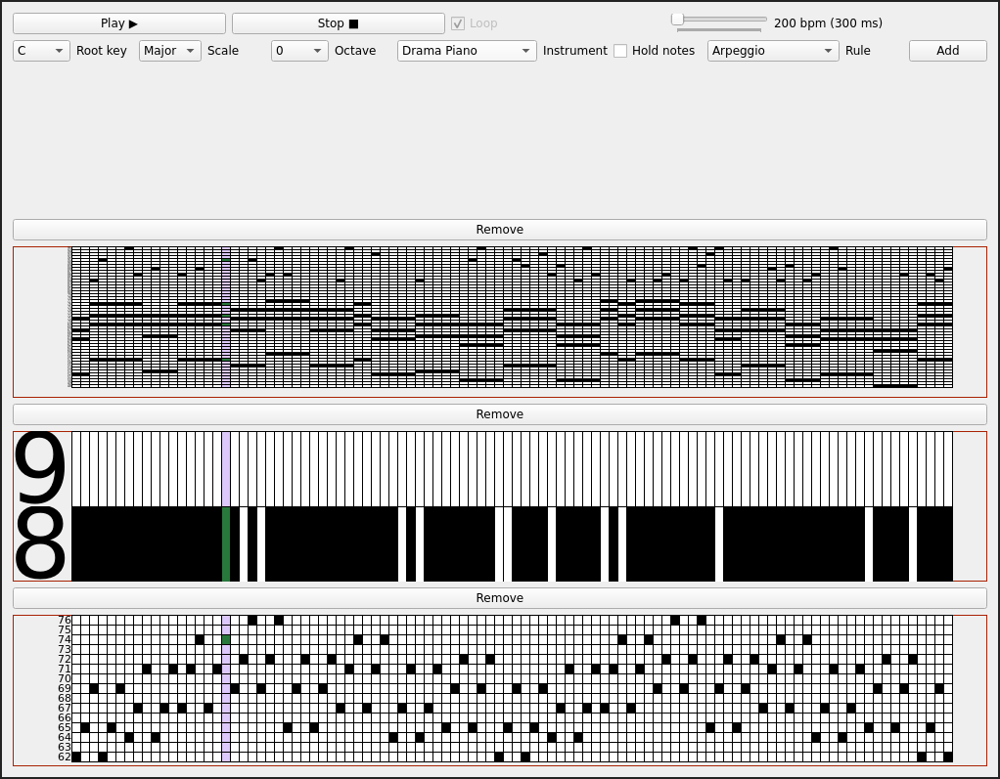

# Cellular Automata Music Generation

## Requirements
- Modern operating system
- Python 3 
- [Fluidsynth 2.2.4](https://github.com/FluidSynth/fluidsynth/wiki/Download)
- PyQt6
- numpy

Download Fluidsynth for your platform and install it on your system: on Windows put all the files from Fluidsynth bin/ directory to the root directory of this project (it should be in the same location as main.py).
Install PyQt6 using pip:
`pip install PyQt6`
Install numpy using pip:
`pip install numpy`

## Running
To run the application execute main.py script using python3 interpreter:
`python main.py`

## Screenshot

